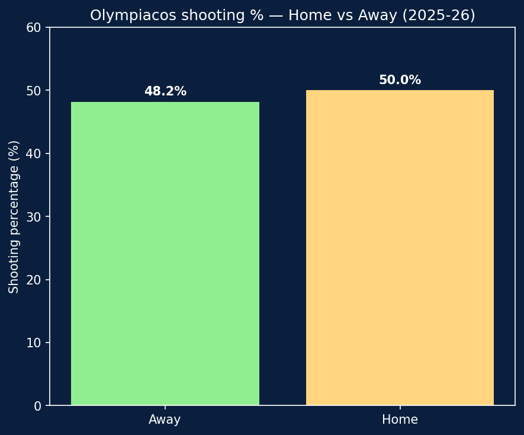
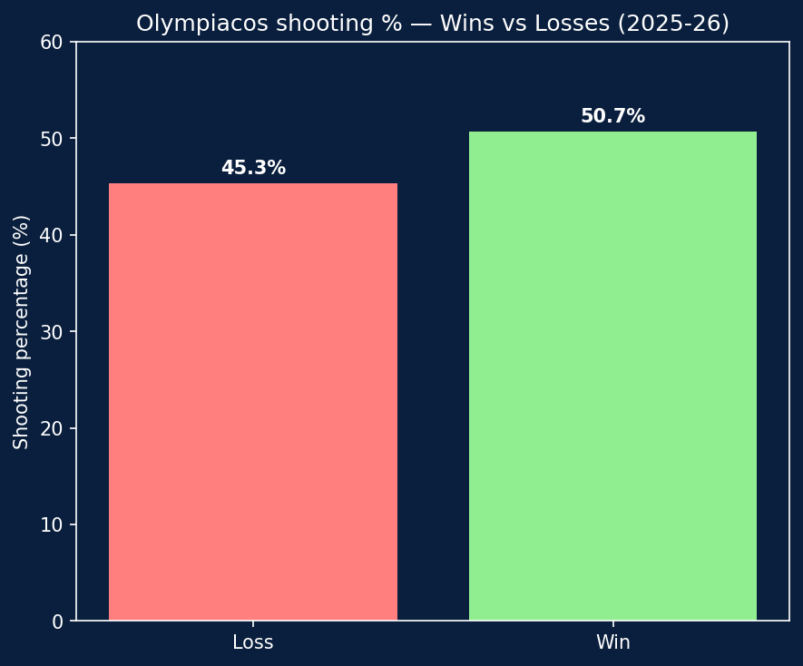
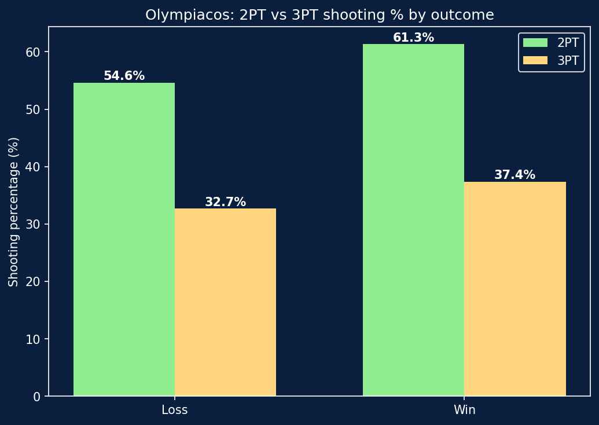
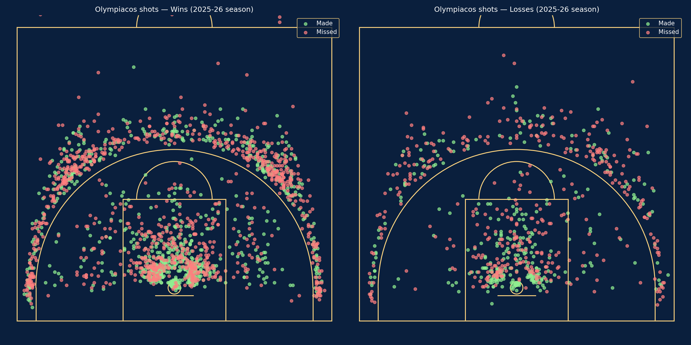

# Olympiacos 2025-26: A Shot Data Analysis of the EuroLeague Champions

A data-driven look at Olympiacos Piraeus' championship-winning 2025-26 EuroLeague season, exploring shooting patterns, efficiency, and what separates their wins from their losses.

## Background

Olympiacos won the 2025-26 EuroLeague title, becoming the first regular-season top seed to win the championship under the current format. This project analyzes all 43 games of their season (i.e., regular season, play-in, playoffs, and Final Four) using shot-level data (every field goal attempt, with court coordinates and outcome).

## Data & Tools

- **Data source**: [Euroleague & Eurocup Datasets](https://www.kaggle.com/datasets/babissamothrakis/euroleague-datasets) (Kaggle), covering every EuroLeague season since 2007-08
- **Tools**: Python, pandas, matplotlib
- **Scope**: 3,504 individual shot attempts by Olympiacos across the 2025-26 season

## Shot Selection: A Modern Offense

Before looking at wins and losses, it's worth understanding *where* Olympiacos shoots from. The distribution is a clear example of modern shot selection:

| Zone | Share of shots |
|---|---|
| Paint | 46.3% |
| 3-point | 43.9% |
| Mid-range | 9.7% |

Nearly all shot attempts come from the two most efficient areas of the floor — close to the rim or beyond the arc — with mid-range shots reduced to under 10% of total attempts. This distribution stays essentially the same whether Olympiacos wins or loses (mid-range: 9.1% in losses vs 10.0% in wins), suggesting shot selection is a stable team identity, not something that shifts based on how the game is going.

## Home vs Away

Olympiacos shoots only marginally better at home (50.0%) than on the road (48.2%) — a small gap that suggests the team's shooting efficiency isn't heavily driven by home-court advantage.

## Wins vs Losses: Same Volume, Different Efficiency

The picture changes when looking at outcome instead of venue. Olympiacos shoots **50.7%** in wins versus **45.3%** in losses — a meaningful 5.4-point gap.

Interestingly, this isn't a matter of shooting *more* in wins. Shot volume is nearly identical regardless of outcome:

| Outcome | Shots per game |
|---|---|
| Win | 63.4 |
| Loss | 63.1 |

The difference is entirely about **efficiency**, not attempts.

### Where does the gap come from?

Breaking the gap down by shot type reveals it's driven more by two-point shooting than by three-point shooting:

| Shot type | Win % | Loss % | Gap |
|---|---|---|---|
| 2PT | 61.3% | 54.6% | +6.7 |
| 3PT | 37.4% | 32.7% | +4.7 |

This is a notable detail: the common assumption might be that three-point shooting swings games, but for Olympiacos the bigger swing happens closer to the basket. When the team struggles, it struggles most to finish around the rim — not just from deep.

## Shot Chart: Wins vs Losses

Visualizing every shot attempt confirms the numbers: both charts show the same shot selection pattern (heavy paint and 3-point presence, minimal mid-range), but the loss chart shows a noticeably higher concentration of missed shots inside the paint.

## Takeaways

- Olympiacos' shot selection (paint + 3-point heavy, minimal mid-range) is a consistent team identity, not something that changes with game outcome
- Shot volume per game barely changes between wins and losses
- The efficiency gap between wins and losses is real (~5 points) and concentrated more in two-point shooting than three-point shooting
- Home-court advantage plays a smaller role in shooting efficiency than the win/loss split does

## How to Reproduce

1. Download the [Euroleague & Eurocup Datasets](https://www.kaggle.com/datasets/babissamothrakis/euroleague-datasets) from Kaggle
2. Place `euroleague_points.csv`, `euroleague_header.csv`, and `euroleague_teams.csv` in the project folder
3. Run `olympiacos_shot_analysis..py` (requires `court_utils.py` in the same folder)

## About

This project combines a background in basketball coaching (8 years, youth and regional level) with data analysis, exploring how sports analytics can inform how teams and coaches understand performance.
